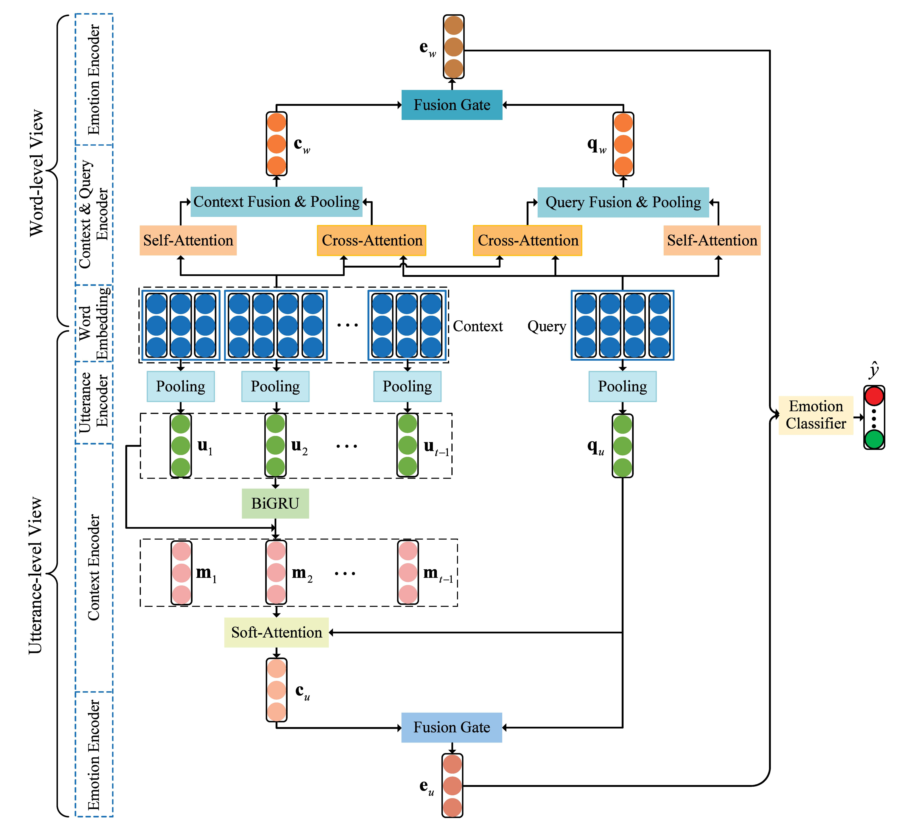

# A multi-view network for real-time emotion recognition in conversations
This repository is the implement of our paper [A multi-view network for real-time emotion recognition in conversations](https://www.sciencedirect.com/science/article/pii/S0950705121009801).

## Model Architecture
<!--  -->
<div align="center">
    
</div>

## Setup
- Check the packages needed or simply run the command:
```console

pip install -r requirements.txt
```
- Download the IEMOCAP and MELD datasets from [AGHMN storage](https://drive.google.com/drive/folders/1RDhrVhTm8tDtbs5BhlEl1QGFPibd94Jo).
- For each dataset, we use ```Preprocess.py``` to preprocess it. You can downloaded the preprocessed datasets from [here](https://drive.google.com/drive/u/1/folders/1d0-rEYuF6W5iKiqjiBVaRD8groSM8iTa), and put them into `Data/`.
- Download the [Pretrained Word2Vec Embeddings](https://code.google.com/archive/p/word2vec/) and save it in `Data/` too.

## Run MVN
- Run the model on IEMOCAP dataset:
```console

bash exec_iemocap.sh
```
- Run the model on MELD dataset:
```console

bash exec_meld.sh
```

## Acknowledgements
- Special thanks to the [AGHMN](https://github.com/wxjiao/AGHMN) for sharing the codes and datasets.
	
## Citation
If you find our work useful for your research, please kindly cite our paper as follows:
```
@article{ma2022multi,
  title={A multi-view network for real-time emotion recognition in conversations},
  author={Ma, Hui and Wang, Jian and Lin, Hongfei and Pan, Xuejun and Zhang, Yijia and Yang, Zhihao},
  journal={Knowledge-Based Systems},
  volume={236},
  pages={107751},
  year={2022},
  publisher={Elsevier}
}
```